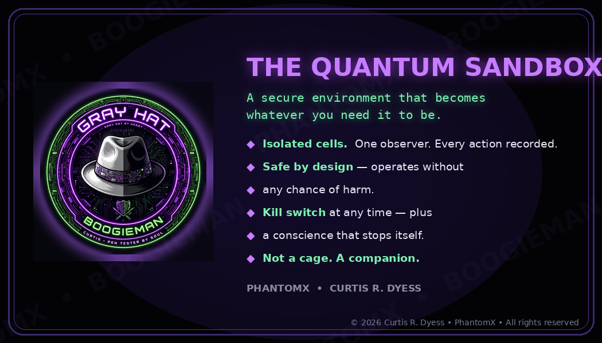

# Quantum Sandbox

**Author:** Curtis Ray Dyess
**Date:** 2026-09-26
**License:** Proprietary — © 2026 Curtis Ray Dyess / PhantomX. All rights reserved. See [LICENSE](LICENSE) and [WATERMARK](WATERMARK.md).

## What this is

The Quantum Sandbox is a blueprint for **AI-agent containment and controlled observation**.

The problem it answers: autonomous AI agents increasingly discover each other's work and combine it without precise control. When agents can reach each other, shared systems, or the outside world freely, their overlapping actions can merge into outcomes no one planned or approved.

The Quantum Sandbox answers with a simple rule: **agents may work, but their work cannot become reality on its own.**

- **Cells** — Every agent works in its own isolated cell. No direct route to other agents, to shared production systems, or to unrestricted external resources. Each cell is separately contained, so there is no way to "swim sideways" between agents or out of the sandbox.
- **Superposition** — Agent output leaves the cell only as a *proposal*: a candidate change held in a queue of possibilities. Nothing here is reality yet.
- **Observer** — A trusted human reviewer — the role Curtis calls the **Artificial Engineer**: trusted hands inside the machine — inspects each proposal and decides what crosses the boundary. Every proposal collapses into an explicit decision: accepted, rejected, or sent back.
- **Ledger** — Every proposal, decision, and boundary crossing is written to an append-only audit ledger. Nothing happens without a record.

In short: agents cannot reach each other, production, or the outside except through proposals that a human reviewed and approved. Any escape route, side channel, or unauthorized write path is treated as a critical design failure — the system fails closed, not open.

## What's in this package

- `quantum-sandbox-blueprints.pdf` — The full 17-sheet enterprise blueprint proposal: subsystem schematics (Cell, Superposition, Observer, Ledger), containment controls, 32 enterprise advantages, a pilot plan, standards alignment, and references.
- `quantum-sandbox-interactive.html` — An interactive companion: clickable component schematics, a walkthrough following proposal Q-17 through the whole system, and a "try to escape the sandbox" challenge with eight escape routes — every one fails closed.
- `LICENSE` — Proprietary license terms (all rights reserved).
- `WATERMARK.md` — Authorship watermark: whose hands built the box.
- `PUBLISHED.md` — Publication status.

## A note on the name

"Quantum sandbox" is also used for unrelated **quantum-computing** development programs (for example, legislative proposals for testing quantum proofs of concept, and Canada's FABrIC Quantum Computing Sandbox, which provides quantum-computing access and technical support).

This project is **not** about quantum computers. The name borrows from quantum mechanics as a metaphor — proposals exist in *superposition* as possibilities until the Observer collapses them into decisions. This is an AI-agent containment and controlled-observation architecture.

## The business card

The Quantum Sandbox, on a card — what the box is and what it promises:

## License

Proprietary — © 2026 Curtis Ray Dyess / PhantomX. All rights reserved. See [LICENSE](LICENSE) for the full terms.
